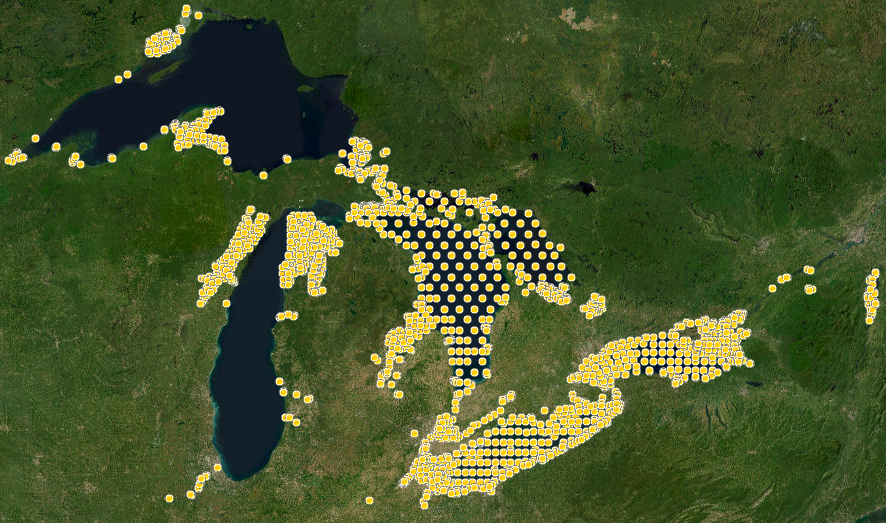

```{r setup, xaringan-themer, include=FALSE, warning=FALSE}
library(xaringanthemer)
style_mono_light(
  base_color = "#23395b",
  header_font_google = google_font("Josefin Sans"),
  text_font_google   = google_font("Montserrat", "300", "300i"),
  code_font_google   = google_font("Fira Mono"),
  base_font_size = '20px',
  text_font_size = '1.3rem',
  code_font_size = '0.6rem'
)
```
```{r xaringan-panelset, echo=FALSE}
xaringanExtra::use_panelset()
```
```{r xaringan-fit-screen, echo=FALSE}
xaringanExtra::use_fit_screen()
```
class: inverse, center, middle


# Wrangling telemetry data





Todd Hayden, Tom Binder, Chris Vandergoot

Iowa Telemetry Workshop | 2023-07-18

---
layout: true
background-image: url(images/GLATOS_logo.png)
background-position: 5% 95%
background-size: 10%


---

# Wrangling telemetry data

### Output
  1. Detections with animal metadata (ID, length, weight, etc)
  2. Detections with location (lat/lon)
  3. Transmissions before after receiver recovery are removed
  4. Tags that are not associated with fish area removed

#### AND

  3. Standardized column names and data types

---

# GLATOS database

<center>

```{r, echo = FALSE}
library(DiagrammeR)
nodes <- data.frame(id = c(1,2,3,4,5,6,7), label= c("Project wkbk", "Tagging", "R. deployment", "R. recovery", "dbase", "dtc", "dtc export"))
edge <- data.frame(from = c(1,1,1,2,3,4,6,5), to = c(2,3,4,5,5,5,5,7))


grph <- create_graph() %>%
  add_global_graph_attrs("layout", "dot", "graph") %>%
  add_global_graph_attrs("concentrate", "true", "graph") %>%
  add_global_graph_attrs(attr = "bgcolor", value = "#E9EBEE", attr_type = "graph") %>%
  add_nodes_from_table(table = nodes, label_col=label) %>%
  add_edges_from_table(table=edge, from_col=from, to_col=to, from_to_map = id_external) %>%
  select_nodes_by_id(nodes = 1:length(labels)) %>%
  set_node_attrs(node_attr = "fixedsize", values = FALSE) %>%
  set_node_attrs_ws(
    node_attr = shape,
    value = "rectangle") %>%
  clear_selection()

render_graph(grph)

```
</center>

---

# Steps for data processing
1. Combine receiver deployment and recovery

--

2. Add receiver latitude and longitude to detections

--

3. Add animal metadata (id, length, weight)

--

4. **Remove detections when receivers were not deployed**

5. **Remove detections that are not assigned to fish**

---


# `glatos` package

### Install instructions:
https://github.com/ocean-tracking-network/glatos/wiki/installation-instructions

- `library(remotes)`
- `install_github('ocean-tracking-network/glatos')`

### After install:

- `library(glatos)`

---

# Resources

## Data loading

- `vignette(package="glatos", topic="data_loading_vignette")`

## Data requirements

- Required column names, data types, format

- `vignette(package="glatos", topic="data_requirements_vignette")`
  
---

# `GLATOS` functions for loading data


1. **`read_glatos_detections`**

     + read detection data from a CSV file, source- GLATOS Data Portal 

2. `read_otn_detections`
     + read detection data from a CSV file, source- Ocean Tracking Network 

3. `read_glatos_receivers`
     + read receiver data from a CSV file, source-  GLATOS Data Portal

---

# `GLATOS` functions for loading data

4. `read_glatos_workbook`
     
	 + read data from a GLATOS project-specific MS Excel workbook (\*.xlsm file), source- GLATOS Data Portal
  
5. `read_vemco_tag_specs`
     
	 + read tag specification data from an MS Excel workbook (\*.xls file), source- Innovasea

---
# Converting data to glatos detection export output

1. Load data into R using some other function (e.g., *read_csv*)

2. Modify data to ensure that all requirements of the desired function are met

## R packages

- `lubridate` - fast functions for handling time/dates in R
  - https://lubridate.tidyverse.org/

---

# R packages

- `data.table` - Extension of data.table, very fast, good for large data

  - https://rdatatable.gitlab.io/data.table/
  
  - "left join" - join two tables on keys
  
  - "left" table only joined if match in "right" table
  
  - All records in "left" table are retained
  
  - `data.table` - x[i, on = "keys"] where x and i are data.tables
  
  - `data.table` is also a `data.frame`

---

# GLATOS database

<center>

```{r, echo = FALSE}
library(DiagrammeR)
nodes <- data.frame(id = c(1,2,3,4,5,6,7), label= c("Project wkbk", "Tagging", "R. deployment", "R. recovery", "dbase", "dtc", "dtc export"))
edge <- data.frame(from = c(1,1,1,2,3,4,6,5), to = c(2,3,4,5,5,5,5,7))


grph <- create_graph() %>%
  add_global_graph_attrs("layout", "dot", "graph") %>%
  add_global_graph_attrs("concentrate", "true", "graph") %>%
  add_global_graph_attrs(attr = "bgcolor", value = "#E9EBEE", attr_type = "graph") %>%
  add_nodes_from_table(table = nodes, label_col=label) %>%
  add_edges_from_table(table=edge, from_col=from, to_col=to, from_to_map = id_external) %>%
  select_nodes_by_id(nodes = 1:length(labels)) %>%
  set_node_attrs(node_attr = "fixedsize", values = FALSE) %>%
  set_node_attrs_ws(
    node_attr = shape,
    value = "rectangle") %>%
  clear_selection()

render_graph(grph)

```
</center>

---

# Receiver location data

.pull-left[
## Required columns
- deploy_lat (numeric)
- deploy_long (numeric)
- recover_date_time (POSIXct timestamp)
- deploy_date_time (POSIXct timestamp)
]

.pull-right[
## Optional columns
- glatos_array (character)
- station (character)
- glatos_project_receiver (character)
]

.center[
### Any data.frame that contains the columns above in the correct format should work with glatos functions that require receiver location data
]
---

# Prepare receiver deployment records
.panelset[
.panel[.panel-name[Load]

```{r rec_dep1, message=FALSE}

# load libraries
library(data.table)
library(lubridate)

# load example receiver deployments
rec_dep <- data.table::fread("ex_glatos_submission/HECWL_GLATOS_Deployment.csv")

```
]

.panel[.panel-name[Peek]
```{r rec_dep1.5, message=FALSE, echo=FALSE}

# take a look
str(rec_dep)
```
]

.panel[.panel-name[Process]

```{r rec_dep2, message=FALSE}
# Need to calculate recover_date_time from GLATOS_recover_date_time and GLATOS_timezone
rec_dep[, DEPLOY_DATE_TIME := fast_strptime(GLATOS_DEPLOY_DATE_TIME,
                                             format = "%Y-%m-%d %H:%M",
                                             tz = "America/Detroit", lt = FALSE)]

rec_dep[, STATION := paste(GLATOS_ARRAY, STATION_NO, sep = "-")]

rec_dep[, INS_SERIAL_NO := as.character(INS_SERIAL_NO)]

```
]

.panel[.panel-name[Output]
```{r rec_dep3, echo=FALSE}
str(rec_dep)

```
]
]

---

# Prepare receiver recovery records

.panelset[
.panel[.panel-name[Load]

```{r recovery1, message=FALSE}

# load example receiver deployments
rec_recover <- data.table::fread("ex_glatos_submission/HECWL_GLATOS_Recovery.csv")
```
]

.panel[.panel-name[Peek]

```{r recovery1.5, echo=FALSE}
# take a look
str(rec_recover)
```
]

.panel[.panel-name[Process]

```{r recovery2, message=FALSE}

# Need to calculate recover_date_time from GLATOS_recover_date_time and GLATOS_timezone
rec_recover[, RECOVER_DATE_TIME := fast_strptime(GLATOS_RECOVER_DATE_TIME,
                                             format = "%Y-%m-%d %H:%M",
                                             tz = "America/Detroit", lt = FALSE)]

rec_recover[, STATION := paste(GLATOS_ARRAY, STATION_NO, sep = "-")]

rec_recover[, INS_SERIAL_NUMBER := as.character(INS_SERIAL_NUMBER)]

```
]

.panel[.panel-name[Output]
```{r recovery3, echo=FALSE}
str(rec_recover)
```
]
]


---

# Join receiver deployments and recoveries

.panelset[
.panel[.panel-name[Code]

```{r recs, message=FALSE}

# Use data.table left join to combine deployments and recoveries
# Simplified 
recs <- rec_recover[rec_dep, .(GLATOS_ARRAY = i.GLATOS_ARRAY,
                      STATION_NO = i.STATION_NO,
                      CONSECUTIVE_DEPLOY_NO = i.CONSECUTIVE_DEPLOY_NO,
                      DEPLOY_DATE_TIME = i.DEPLOY_DATE_TIME,
                      DEPLOY_LAT = i.DEPLOY_LAT,
                      DEPLOY_LONG = i.DEPLOY_LONG,
                      INS_MODEL_NO = i.INS_MODEL_NO,
                      INS_SERIAL_NO = i.INS_SERIAL_NO,
                      STATION = i.STATION,
                      RECOVER_DATE_TIME = x.RECOVER_DATE_TIME),
                    on = .(GLATOS_ARRAY,
                           STATION_NO,
                           CONSECUTIVE_DEPLOY_NO,
                           STATION,
                           GLATOS_PROJECT,
                           INS_SERIAL_NUMBER = INS_SERIAL_NO)]

```
]


.panel[.panel-name[Table]

```{r, recs_out, echo=FALSE}
recs
```
]
]

---

# GLATOS database

<center>

```{r, echo = FALSE}
library(DiagrammeR)
nodes <- data.frame(id = c(1,2,3,4,5,6,7), label= c("Project wkbk", "Tagging", "R. deployment", "R. recovery", "dbase", "dtc", "dtc export"))
edge <- data.frame(from = c(1,1,1,2,3,4,6,5), to = c(2,3,4,5,5,5,5,7))


grph <- create_graph() %>%
  add_global_graph_attrs("layout", "dot", "graph") %>%
  add_global_graph_attrs("concentrate", "true", "graph") %>%
  add_global_graph_attrs(attr = "bgcolor", value = "#E9EBEE", attr_type = "graph") %>%
  add_nodes_from_table(table = nodes, label_col=label) %>%
  add_edges_from_table(table=edge, from_col=from, to_col=to, from_to_map = id_external) %>%
  select_nodes_by_id(nodes = 1:length(labels)) %>%
  set_node_attrs(node_attr = "fixedsize", values = FALSE) %>%
  set_node_attrs_ws(
    node_attr = shape,
    value = "rectangle") %>%
  clear_selection()

render_graph(grph)

```
</center>

---


# Tagging 
- No required columns for `glatos` package functions

.panelset[
.panel[.panel-name[Load]

```{r tag, message=FALSE}

# load example tagging data
tag <- fread("ex_glatos_submission/HECWL_GLATOS_Tagging.csv")
```
]

.panel[.panel-name[Peek]
```{r tag1, echo=FALSE}
# take a look
str(tag)
```
]

.panel[.panel-name[Process]

```{r tag2}
# lots of columns, simplify for example
tag <- tag[, c("ANIMAL_ID", "TAG_ID_CODE", "TAG_CODE_SPACE", "COMMON_NAME_E", "SCIENTIFIC_NAME", "GLATOS_RELEASE_DATE_TIME",
               "GLATOS_PROJECT", "GLATOS_CAUGHT_DATE")]

# convert animal_id to character
tag[, ANIMAL_ID := as.character(ANIMAL_ID)]

# add release date time as POSIXct
tag[, RELEASE_DATE_TIME := as.POSIXct(GLATOS_RELEASE_DATE_TIME, tz = "America/Detroit")]

# Convert caught date to Date class
tag[, GLATOS_recap_date := as.POSIXct(as.Date(GLATOS_CAUGHT_DATE), tz = "UTC")]

# convert TAG_ID_CODE to character
tag[, TAG_ID_CODE := as.character(TAG_ID_CODE)]

```
]

.panel[.panel-name[Output]

```{r tag_out, message=FALSE, echo=FALSE}
str(tag)
```
]
]

---


# GLATOS database

<center>

```{r, echo = FALSE}
library(DiagrammeR)
nodes <- data.frame(id = c(1,2,3,4,5,6,7), label= c("Project wkbk", "Tagging", "R. deployment", "R. recovery", "dbase", "dtc", "dtc export"))
edge <- data.frame(from = c(1,1,1,2,3,4,6,5), to = c(2,3,4,5,5,5,5,7))


grph <- create_graph() %>%
  add_global_graph_attrs("layout", "dot", "graph") %>%
  add_global_graph_attrs("concentrate", "true", "graph") %>%
  add_global_graph_attrs(attr = "bgcolor", value = "#E9EBEE", attr_type = "graph") %>%
  add_nodes_from_table(table = nodes, label_col=label) %>%
  add_edges_from_table(table=edge, from_col=from, to_col=to, from_to_map = id_external) %>%
  select_nodes_by_id(nodes = 1:length(labels)) %>%
  set_node_attrs(node_attr = "fixedsize", values = FALSE) %>%
  set_node_attrs_ws(
    node_attr = shape,
    value = "rectangle") %>%
  clear_selection()

render_graph(grph)

```
</center>

---

# Detection data

.pull-left[
## Required columns
- Detection_timestamp_utc (POSIXct)
- receiver_sn (character)
- deploy_lat (numeric)
- deploy_long (numeric)
- transmitter_codespace (character)
- transmitter_id (character)
- sensor_value (numeric)
- sensor_unit (character)
- animal_id (character)
]

.pull-right[
## Optional columns
- glatos_array (character)
- station (character)
- glatos_project_receiver (character)
]

---

# Detection data
- Export detections from *.vrl files from Innovasea VUE software (*.csv)
- Not going to step through the process for exporting detections from VUE database

VUE operators manual
https://go.innovasea.com/vue_manual.pdf

.center[

]

---
# Detection data

.panelset[
.panel[.panel-name[Load]

```{r dtc_import, message=FALSE}

# load detection file from VUE
dtc <- fread("ex_glatos_submission/EX_IOWA_export.csv", sep=",", header=TRUE, fill=TRUE)
```
]

.panel[.panel-name[Peek]

```{r dtc1, echo=FALSE}
str(dtc)
```
]

.panel[.panel-name[Process]

```{r dtc2}

# change column name "date and time" to "detection_timestamp_utc"
setnames(dtc, c("Date and Time (UTC)"), c("detection_timestamp_utc"))

# make new column "receiver_sn" from "Receiver"
dtc[, receiver_sn := strsplit(Receiver, "-")[[1]][2], by = "Receiver"]

# extract transmitter_codespace and transmitter_id from "Transmitter" column
# step 1- create function to extract id from Transmitter
parse_tid <- function(x){strsplit(x, "-")[[1]][3]}

# stetp 2- create function to extract codespace from Transmitter
parse_tcs <- function(x){
  #split on "-" and keep first two extracted elements
  tx <- strsplit(x, "-")[[1]][1:2]
  return(paste(tx[1:2], collapse="-"))
}

dtc[, `:=`(transmitter_codespace=parse_tcs(Transmitter),
           transmitter_id=parse_tid(Transmitter)),
    by="Transmitter"]

# change names for "sensor value" and "sensor unit"
setnames(dtc, c("Sensor Value", "Sensor Unit"), c("sensor_value", "sensor_unit"))
```
]

.panel[.panel-name[Table]

```{r dtc_out, echo=FALSE}
str(dtc)
```
]
]

---

# GLATOS database

<center>

```{r, echo = FALSE}
library(DiagrammeR)
nodes <- data.frame(id = c(1,2,3,4,5,6,7), label= c("Project wkbk", "Tagging", "R. deployment", "R. recovery", "dbase", "dtc", "dtc export"))
edge <- data.frame(from = c(1,1,1,2,3,4,6,5), to = c(2,3,4,5,5,5,5,7))


grph <- create_graph() %>%
  add_global_graph_attrs("layout", "dot", "graph") %>%
  add_global_graph_attrs("concentrate", "true", "graph") %>%
  add_global_graph_attrs(attr = "bgcolor", value = "#E9EBEE", attr_type = "graph") %>%
  add_nodes_from_table(table = nodes, label_col=label) %>%
  add_edges_from_table(table=edge, from_col=from, to_col=to, from_to_map = id_external) %>%
  select_nodes_by_id(nodes = 1:length(labels)) %>%
  set_node_attrs(node_attr = "fixedsize", values = FALSE) %>%
  set_node_attrs_ws(
    node_attr = shape,
    value = "rectangle") %>%
  clear_selection()

render_graph(grph)

```
</center>

---

# Add 'animal_id' to detections

- "ANIMAL_ID" ("tagging" data)
- Left join, constrained by tag ID code, tag release date/time, and tag recover date/time

## why?

- Account for multiple deployments of tag 
   - fish is caught, tag recovered, and redeployed
- Output includes only detections after fish release and before recapture
- Subset columns in output
- ANIMAL_ID is required column

---

# Add 'animal_id' to detections

.panelset[
.panel[.panel-name[Tagging]
```{r tagjoin, echo=FALSE}
str(tag)
```
]

.panel[.panel-name[Detections]
```{r tagjoindtc, echo=FALSE}
str(dtc)
```
]

.panel[.panel-name[Join data]
```{r join_tag_and_dtc}

# join animal_id to detections with data.table non-equi join
dtc <- tag[dtc, .(ANIMAL_ID,
                  detection_timestamp_utc,
                  Receiver,
                  Transmitter,
                  sensor_value,
                  sensor_unit,
                  receiver_sn,
                  transmitter_codespace,
                  transmitter_id),
           on = .(TAG_ID_CODE = transmitter_id,
                  TAG_CODE_SPACE = transmitter_codespace,
                  RELEASE_DATE_TIME <= detection_timestamp_utc,
                  GLATOS_recap_date >= detection_timestamp_utc),
           nomatch = NULL]
                  
```
]

.panel[.panel-name[Output]
```{r animal_idJoin, echo=FALSE}
dtc
```
]
]

---


# GLATOS database

<center>

```{r, echo = FALSE}
library(DiagrammeR)
nodes <- data.frame(id = c(1,2,3,4,5,6,7), label= c("Project wkbk", "Tagging", "R. deployment", "R. recovery", "dbase", "dtc", "dtc export"))
edge <- data.frame(from = c(1,1,1,2,3,4,6,5), to = c(2,3,4,5,5,5,5,7))


grph <- create_graph() %>%
  add_global_graph_attrs("layout", "dot", "graph") %>%
  add_global_graph_attrs("concentrate", "true", "graph") %>%
  add_global_graph_attrs(attr = "bgcolor", value = "#E9EBEE", attr_type = "graph") %>%
  add_nodes_from_table(table = nodes, label_col=label) %>%
  add_edges_from_table(table=edge, from_col=from, to_col=to, from_to_map = id_external) %>%
  select_nodes_by_id(nodes = 1:length(labels)) %>%
  set_node_attrs(node_attr = "fixedsize", values = FALSE) %>%
  set_node_attrs_ws(
    node_attr = shape,
    value = "rectangle") %>%
  clear_selection()

render_graph(grph)

```
</center>

---


# Add receiver latitude and longitude to each detection

- Receiver latitude and longitude info is in "recs" object
- Need to remove detections that happened prior to receiver deployment or after receiver deployment
- Required columns
---

# Add receiver latitude and longitude to each detection

.panelset[
.panel[.panel-name[Receivers]
```{r tagjoin1, echo=FALSE}
str(recs)
```
]

.panel[.panel-name[Detections]
```{r tagjoindtc1, echo=FALSE}
str(dtc)
```
]

.panel[.panel-name[Join data]

```{r join_dtc_receivers}

# add receiver deployment lat/lon
dtc <- recs[dtc, .(ANIMAL_ID,
                   detection_timestamp_utc,
                   Receiver,
                   Transmitter,
                   sensor_value,
                   sensor_unit,
                   receiver_sn,
                   transmitter_codespace,
                   transmitter_id,
                   DEPLOY_LAT,
                   DEPLOY_LONG),
            on = .(INS_SERIAL_NO = receiver_sn,
                   DEPLOY_DATE_TIME <= detection_timestamp_utc,
                   RECOVER_DATE_TIME >= detection_timestamp_utc),
            nomatch = NULL]
```
]


.panel[.panel-name[Output]
```{r final, echo=FALSE}
head(dtc, n=10)
```
]
]

---

# Thanks!

For help, contact:

Todd Hayden
thayden@usgs.gov


`glatos` website:

https://github.com/ocean-tracking-network/glatos

Github repository (download all code and data for presentation):
https://github.com/haydento/Iowa_dbase

View presentation:
haydento.github.io/Iowa_dbase/


